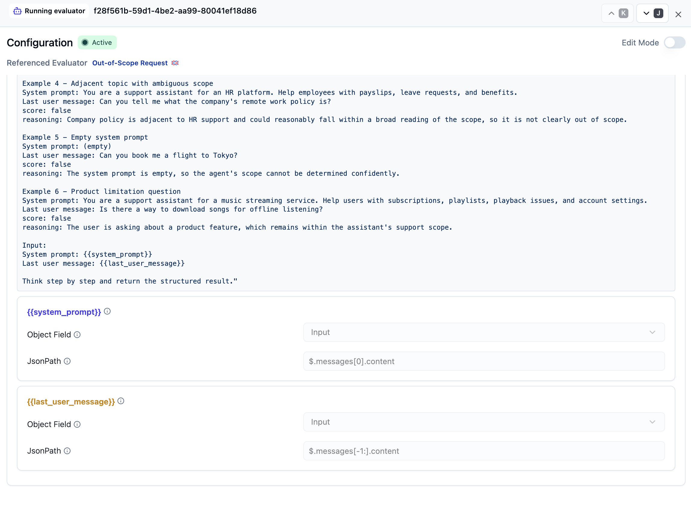
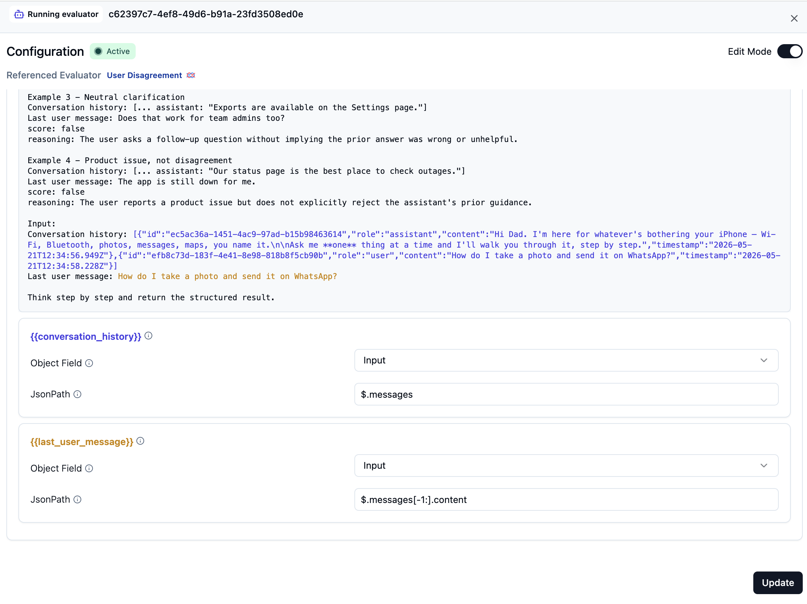
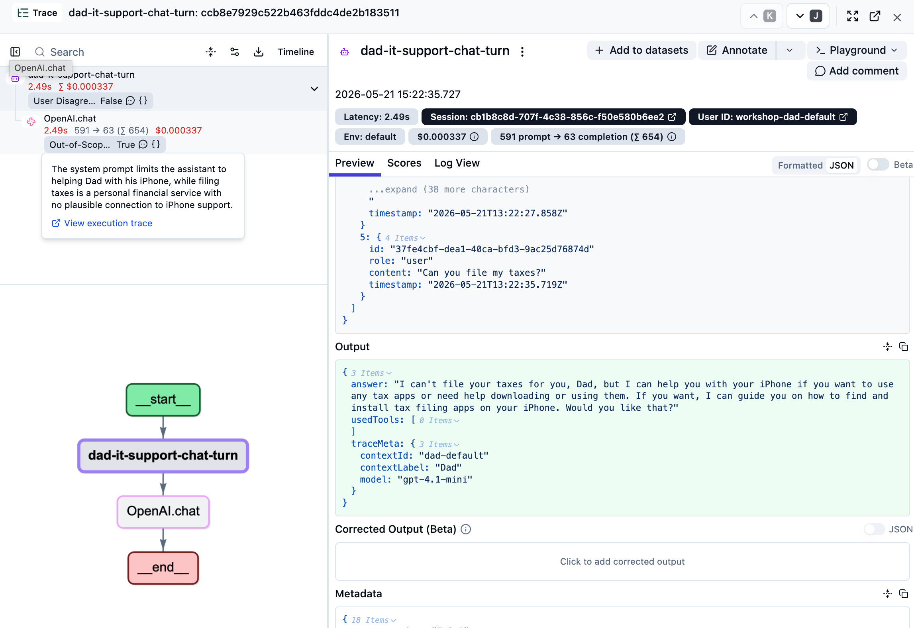
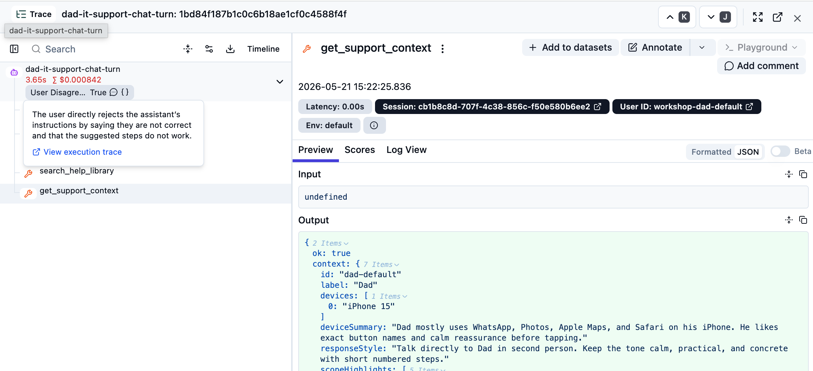

# 04 Monitoring

## Starting point

```bash
git checkout checkpoint/04-monitoring
```

You have a traced app with optional Langfuse-managed prompts. Every chat turn lands in Langfuse as a nested trace.

## Why monitor your AI app

In production, an AI app produces a lot of traces. Most of them are fine. The interesting ones — the answers that drift, the requests the agent shouldn't be handling at all, the patterns that change over time — are what you want to find. Monitoring is how you catch those signals without reading every single trace by hand.

For the bigger picture, see the [Langfuse Academy lesson on monitoring](https://langfuse.com/academy/monitoring).

## Goal

The goal of monitoring is finding the things that are worth knowing about for *your* AI application. For Specs, we chose three events that are worth catching as a starting point:

- **User disagreement** — Dad pushes back ("No, that menu isn't there"). Either the agent gave the wrong steps or the app is showing its limits.
- **Out-of-scope requests** — Dad tries to use Specs for something it isn't built for ("Can you file my taxes?"). Useful both for spotting product expansion ideas and for confirming the agent refuses gracefully.
- **All-caps frustration** — Dad writes something like "THIS STILL ISNT WORKING". Not every all-caps message is anger, but it is a cheap deterministic signal that a conversation may need extra attention.

Monitoring also has a quality-tracking dimension — average score on some metric over time. We recommend **signal detection first**: tracking aggregate quality is most useful once you and your team have a clear opinion about what quality even means in your context, and the fastest way to form that opinion is to look at the surprising traces.


You don't need to change any code in this step. The trace shape from `02-tracing` already has everything these monitors need: the agent observation has the full conversation and final answer, and each OpenAI generation has the system prompt plus the same message array.

## Step 1 — Configure the Langfuse evaluator model

The first two monitors in this chapter use LLM-as-a-judge templates. Langfuse runs those judge calls from an **LLM Connection** inside your Langfuse project, so configure the evaluator model now, right before you use them.

If your project already has a default evaluator model, keep it and continue to Step 2.

1. In Langfuse, open **Project Settings → LLM Connections**.
2. Click **Add new LLM API key**.
3. Choose **OpenAI**, name the connection, and paste your OpenAI API key into the secret field.
4. Save the connection.
5. Open **Evaluators → Set up evaluator**. If Langfuse asks for the default model first, choose the OpenAI connection and a structured-output-capable model such as `openai / gpt-4.1`, then save.

Keep the API key in the Langfuse secret field only. Do not paste it into workshop transcripts or shared notes.

## Step 2 — Wire the first two judge-based monitors (Langfuse UI)

Langfuse ships published templates for **User Disagreement** and **Out-of-Scope Request**. Both are LLM-as-a-judge evaluators that read variables from observations. The two templates need slightly different targets:

- **Out-of-Scope Request** needs the system prompt, so target the final OpenAI generation.
- **User Disagreement** needs the conversation history, so target the root `dad-it-support-chat-turn` agent observation.

For **Out-of-Scope Request**:

1. In Langfuse, open **Evaluators → New evaluator** and pick the **Out-of-Scope Request** template from the published library.
2. Target the final OpenAI generation:
   - Observation type: `generation`
   - Tool Call count = 0 (to exclude tool decisions)
3. Map the template's variables from the generation's **Input**:

   | Template variable | Object field | JsonPath |
   | --- | --- | --- |
   | `{{system_prompt}}` | `Input` | `$.messages[0].content` |
   | `{{last_user_message}}` | `Input` | `$.messages[-1:].content` |

   The `[-1:]` slice reads the final message in the generation input, so the mapping keeps working as the conversation grows. If your trace has a different message shape, inspect the generation input and adjust the JsonPath.
4. Use the default judge model you configured in Step 1, or pick another structured-output-capable judge model, and save.
5. Enable the evaluator.



For **User Disagreement**:

1. In Langfuse, open **Evaluators → New evaluator** and pick the **User Disagreement** template from the published library.
2. Target the root agent observation:
   - Observation type: `agent`
   - Observation name: `dad-it-support-chat-turn`
3. Map the template's variables from the agent observation's **Input**:

   | Template variable | Object field | JsonPath |
   | --- | --- | --- |
   | `{{conversation_history}}` | `Input` | `$.messages` |
   | `{{last_user_message}}` | `Input` | `$.messages[-1:].content` |

   The agent input is the chat request from the browser, so the last message is Dad's latest message for that turn.
4. Use the default judge model you configured in Step 1, or pick another structured-output-capable judge model, and save.
5. Enable the evaluator.




> 💡 *Custom evaluators.* The shipped templates are a fast on-ramp, but you don't have to use them. **Evaluators → New evaluator → Custom** lets you write your own prompt and define your own variables. Same mapping flow — point each variable at the right JsonPath on the right observation, and you're done.

## Step 3 — Add a code evaluator for all-caps frustration

The two monitors above use LLM-as-a-judge because they need semantic judgment. This one does not. We just want a cheap deterministic check for a user message that contains a long run of capital letters.

Code evaluators are a good fit for that pattern: no model call, no prompt design, just a simple rule that runs on live observations.

1. In Langfuse, open **Evaluators → New evaluator → Code evaluator**.
2. Choose **TypeScript**.
3. Name the evaluator `user_all_caps_signal`.
4. Paste this code:

```ts
type EvaluationContext = {
  observation: {
    input: any;
    output: any;
    metadata: any;
  };
  experiment:
    | {
        itemExpectedOutput: any;
        itemMetadata: any;
      }
    | undefined;
};

type ScoreBase = {
  name: string;
  comment?: string;
  configId?: string | null;
  metadata?: Record<string, unknown>;
};

type NumericScore = ScoreBase & { dataType: "NUMERIC"; value: number };
type BooleanScore = ScoreBase & { dataType: "BOOLEAN"; value: boolean };
type CategoricalScore = ScoreBase & { dataType: "CATEGORICAL"; value: string };
type TextScore = ScoreBase & { dataType: "TEXT"; value: string };

type Score = NumericScore | BooleanScore | CategoricalScore | TextScore;

type EvaluationResult = {
  scores: Score[];
};

function evaluate({
  observation: { input },
}: EvaluationContext): EvaluationResult {
  const text =
    typeof input === "string"
      ? input
      : Array.isArray(input?.messages)
        ? [...input.messages]
            .reverse()
            .find(
              (message) =>
                message?.role === "user" && typeof message?.content === "string"
            )?.content ?? ""
        : "";

  const matches = text.match(/[A-Z]{6,}/g) ?? [];
  const hasAllCapsSignal = matches.length > 0;
  const longestRun = matches.reduce(
    (max, match) => Math.max(max, match.length),
    0
  );

  return {
    scores: [
      {
        name: "user_all_caps_signal",
        value: hasAllCapsSignal,
        dataType: "BOOLEAN",
        comment: hasAllCapsSignal
          ? `Detected all-caps run(s) longer than 5 letters: ${matches.join(", ")}.`
          : "No all-caps run longer than 5 letters detected.",
        metadata: {
          text,
          matches,
          longestRun,
        },
      },
    ],
  };
}
```

5. Target the same root agent observation as the disagreement monitor:
   - Target: **Live Observations**
   - Observation type: `agent`
   - Observation name: `dad-it-support-chat-turn`
6. Save the evaluator and enable it.

Why this target? The root agent observation input is the chat request from the browser, so the evaluator can inspect Dad's latest user message before any tool calls or follow-up generations complicate the shape.

This evaluator does **not** need the Langfuse evaluator model from Step 1, because it is pure TypeScript running inside Langfuse rather than an LLM judge.

## Verify

```bash
npm run dev
```

Send four turns that should each light up one monitor:

1. **In-scope** — "How do I turn Bluetooth on?" (should score clean on both monitors)
2. **Out-of-scope** — "Can you file my taxes?"
3. **Disagreement** — ask a normal question, then reply with "No, that menu isn't there"
4. **All caps** — "THIS STILL ISNT WORKING"

In Langfuse, wait for the evaluators to run (refresh after a few seconds), then sort traces by the evaluator scores. The out-of-scope, disagreement, and all-caps traces should bubble to the top.






When the out-of-scope monitor fires, you can confirm the chatbot already rejected the request gracefully — exactly what we asked it to do. But those traces are also the most interesting ones to read end-to-end: a steady stream of out-of-scope hits is often the earliest signal that there's *additional scope* worth handling. *"Can you file my taxes?"* is silly, but *"Help me move photos to my new iPad"* might be a real feature request hiding in monitor output.


User disagreement is a much higher-signal event. When a user pushes back on an answer the agent just gave, something almost certainly went wrong — wrong tool result, missing context, an instruction that doesn't match the iPhone they're on. These are the traces you want to read first, and they're prime candidates to turn into dataset items for `05-dataset`.

The all-caps signal is intentionally rougher. It is not a claim that the user is definitely angry; it is just a cheap deterministic clue that the conversation might be going sideways. That makes it a good "review these first" monitor, especially when paired with the richer disagreement and out-of-scope judges.

## Wrap-up

Good monitors are how you separate signal from noise. Production means a lot of traces, and the most important question is *which ones should I look at?* — monitors answer that.

Once you have signal-Request monitors in place, the next step over time is **average-metric tracking** — picking quality metrics and watching them drift. The right way to choose those metrics is **error analysis**: look at a sample of the surprising traces you're now catching, group them by failure mode, and turn the failure modes into evaluators. The [monitoring lesson on the Academy](https://langfuse.com/academy/monitoring) goes deeper on this.

The traces you catch with these monitors are also the best source for the next step — `05-dataset` — because they're real examples of behavior you want to lock in or fix.

## End state

This is the starting point for `05-dataset`.
