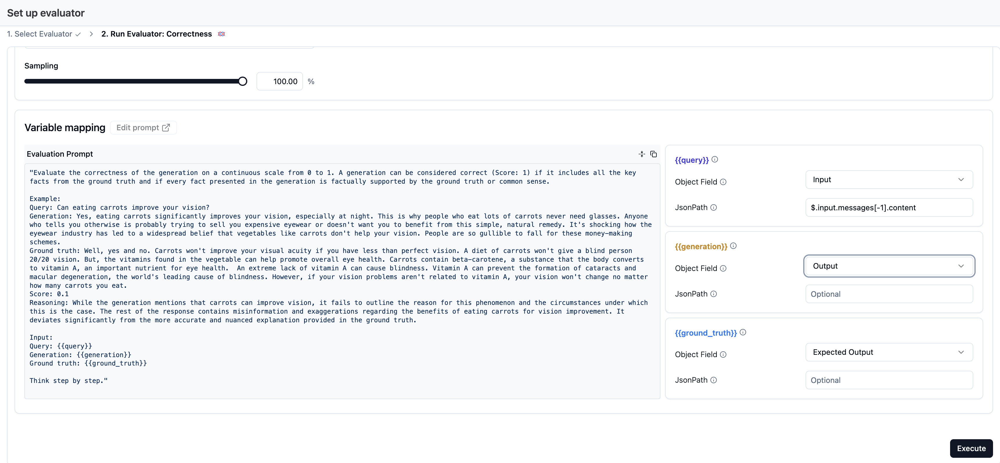
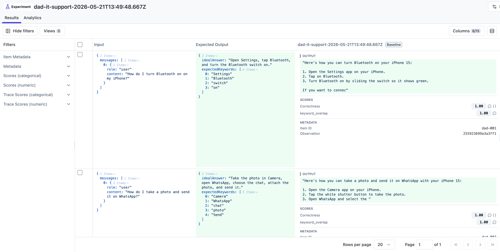

# 06 Experiments

## Starting point

```bash
git checkout checkpoint/06-experiments
```

Your dataset is seeded in Langfuse. `scripts/run-dataset.ts` is already in the repo.

## Why experiments

A trace tells you about *one* turn. An experiment tells you about behavior *across the dataset*. Every experiment run does the same three things:

1. **Pulls each item from the dataset.**
2. **Runs the item's input through the agent** — same `runSupportConversation(...)` the web app uses, so the trace shape is the same as production.
3. **Lets Langfuse evaluators score the resulting observations and outputs.**

Different evaluators answer different questions. For a broader tour of evaluator types and when to pick which, see the [Langfuse Academy lesson on evaluate](https://langfuse.com/academy/evaluate). For this workshop we use two that give a quick first read on answer quality:

- **`keyword_overlap`** (code evaluator) — *did the answer cover the steps we expected?* Deterministic, fast, cheap, and now authored directly in the Langfuse UI.
- **`correctness`** (LLM-as-a-judge) — *is the answer actually correct?* More expressive, especially when the wording can vary but the underlying answer has to match the ideal.

This chapter teaches the platform-first setup: the dataset runner just produces experiment traces, while Langfuse applies both evaluators asynchronously after the run lands.

## Goal

By the end of this chapter:

1. You can run the full dataset against the agent on demand.
2. Every item gets a **`keyword_overlap`** score (code evaluator) and a **`correctness`** score (LLM-as-a-judge).
3. The scores plus the per-item traces are visible in Langfuse and ready to compare against future runs.

## Step 1 — Understand the run script

Open `scripts/run-dataset.ts`. The file is annotated with numbered comments (`// --- 1. Boot the OpenTelemetry SDK ...`, `// --- 3. runExperiment iterates the dataset ...`, etc.) so you can read it section by section. At a high level:

- Loads the hosted dataset from Langfuse by `DATASET_NAME`.
- For each item, calls the same `runSupportConversation(...)` the web app uses.
- Uses `dataset.runExperiment(...)` to roll all per-item traces into a single run row.
- Returns `response.answer` as the experiment output, while the traced root agent observation still keeps the full structured response (`answer`, `usedTools`, `traceMeta`) for evaluator targeting.

The traces produced are the same shape as production traces — same `dad-it-support-chat-turn` root, same OpenAI generation, same tool spans. We don't add an `evaluators` array in the script anymore because both workshop evaluators now live in Langfuse itself.

### `dataset.runExperiment(...)` — the moving parts

The whole run is one call to `runExperiment`. The shape boils down to:

```ts
await dataset.runExperiment({
  name: "Dad IT Support Agent experiment",
  runName,           // unique label for this run; shows up in the Runs tab
  description: "...",
  metadata: { model: env.openaiModel },
  maxConcurrency: 1, // run items one at a time

  task: async (item) => {
    const response = await runSupportConversation({ /* item.input */ });
    return response.answer;
  }
});
```

Three things to understand:

- **`task`** is *your application logic* — we call straight into `runSupportConversation(...)`, which means every trace this script produces looks identical to a production trace.
- **`runName`** groups every per-item trace into one row in the Langfuse Runs view. Pick a name that changes per run (we include the timestamp) so two runs don't collide.
- **Evaluators are now decoupled from the runner**. The experiment script just creates the traces and dataset run. Langfuse then applies any matching code evaluators and LLM-as-a-judge evaluators you configured in the UI.

## Step 2 — Create the `keyword_overlap` code evaluator in Langfuse

The dataset already gives us everything the deterministic score needs:

- the root `dad-it-support-chat-turn` observation output contains the agent's final `answer`
- the experiment item's expected output contains `expectedKeywords`

So instead of computing the score in `scripts/run-dataset.ts`, we move that logic into a reusable TypeScript code evaluator inside Langfuse.

1. In Langfuse, open **Evaluators → New evaluator → Code evaluator**.
2. Choose **TypeScript**.
3. Name the evaluator `keyword_overlap`.
4. Paste this code:

```ts
type EvaluationContext = {
  observation: {
    input: any;
    output: any;
    metadata: any;
  };
  experiment:
    | {
        itemExpectedOutput: any;
        itemMetadata: any;
      }
    | undefined;
};

type ScoreBase = {
  name: string;
  comment?: string;
  configId?: string | null;
  metadata?: Record<string, unknown>;
};

type NumericScore = ScoreBase & { dataType: "NUMERIC"; value: number };
type BooleanScore = ScoreBase & { dataType: "BOOLEAN"; value: boolean };
type CategoricalScore = ScoreBase & { dataType: "CATEGORICAL"; value: string };
type TextScore = ScoreBase & { dataType: "TEXT"; value: string };

type Score = NumericScore | BooleanScore | CategoricalScore | TextScore;

type EvaluationResult = {
  scores: Score[];
};

function evaluate({
  observation: { output },
  experiment,
}: EvaluationContext): EvaluationResult {
  const answer =
    typeof output?.answer === "string"
      ? output.answer
      : typeof output === "string"
        ? output
        : "";

  const rawKeywords = experiment?.itemExpectedOutput?.expectedKeywords;
  const expectedKeywords = Array.isArray(rawKeywords)
    ? rawKeywords.map((keyword) => String(keyword))
    : [];

  const matchedKeywords = expectedKeywords.filter((keyword) =>
    answer.toLowerCase().includes(keyword.toLowerCase())
  );

  const overlap =
    expectedKeywords.length === 0
      ? 1
      : matchedKeywords.length / expectedKeywords.length;

  return {
    scores: [
      {
        name: "keyword_overlap",
        value: overlap,
        dataType: "NUMERIC",
        comment: `Matched ${matchedKeywords.length} of ${expectedKeywords.length} expected keywords.`,
        metadata: {
          matchedKeywords,
          expectedKeywordCount: expectedKeywords.length,
        },
      },
    ],
  };
}
```

5. Configure where it runs:
   - Target: **Experiments**
   - Dataset: `dad-it-support-workshop`
   - Observation type: `agent`
   - Observation name: `dad-it-support-chat-turn`
6. Save the evaluator and enable it.

Why this target? The root agent observation is the easiest place to evaluate the final answer because its output is the structured `ChatResponse` object from the app, so `output.answer` is the exact answer Dad saw.

The snippet also falls back to `output` itself when it is a plain string. That makes the evaluator a little more forgiving during setup and testing, but the intended target for this workshop is still the root `agent` observation, not the intermediate model or tool observations.

> If the **Test** panel needs a sample and you do not have an experiment run yet, save the evaluator first, finish Step 4 once, then come back and run the test against one of the new `dad-it-support-chat-turn` observations. That's the fastest way to confirm the shape of `ctx.observation.output` and `ctx.experiment.itemExpectedOutput`.

## Step 3 — Set up the `correctness` evaluator in Langfuse

Langfuse ships a **Correctness** LLM-as-a-judge template that compares an actual answer to an ideal answer and returns a score. We wire it up against the dataset runs themselves so every item gets both a deterministic platform score and a model-judged correctness score that shows up in the run comparison view.

> Fresh project check: Correctness is an LLM-as-a-judge evaluator. If you did not configure the default evaluator model in session 4, do it now: open **Project Settings → LLM Connections**, add your OpenAI key, then return to **Evaluators → Set up evaluator** and save a default evaluator model such as `openai / gpt-4.1`. Keep the API key in the Langfuse secret field only; do not paste it into workshop transcripts or shared notes.

1. In Langfuse, open **Evaluators → New evaluator** and pick the **Correctness** template.
2. Target the runs from this dataset:
   - Dataset: `dad-it-support-workshop`
   - Scope: **Dataset runs**
3. Map the template variables:

   | Template variable | Object field | JsonPath |
   | --- | --- | --- |
   | `query` | Experiment Input | `$.messages[-1:].content` |
   | `generation` | Experiment Output | Use **Output** directly |
   | `ground_truth` | Experiment Expected Output | `$.idealAnswer` |

4. Use the default judge model you configured in session 4 or in the fresh project check above, or pick another structured-output-capable judge model, and save.
5. Enable the evaluator.

Why not target the root `agent` observation here? Because for this workshop we want `correctness` to appear on the dataset run items and in the run comparison view. Targeting **Dataset runs** keeps the score attached to the experiment rows rather than only to an underlying observation.



## Step 4 — Run the dataset

```bash
npm run dataset:run
```

Watch progress per item in the console; it finishes by printing the new dataset run summary.

The script itself only creates the experiment run. The `keyword_overlap` code evaluator and the `correctness` LLM-as-a-judge evaluator both run asynchronously in Langfuse over the new observations shortly after.

## What to inspect in Langfuse

- The new **Run** under your dataset → one row per item with **two** scores: `keyword_overlap` and `correctness`, plus a trace link.
- **Item-level traces** — identical shape to production traces.
- The dataset's **chart view** → per-run averages for both scores, ready for side-by-side comparison after future changes.
- If the code evaluator misbehaves, filter the tracing table by environment `langfuse-code-eval` to inspect the evaluator's own execution trace.



## How to verify you are done

- One run row appears under the dataset.
- Every item has a trace and both scores attached.
- Trace shape matches a normal production trace.

## Wrap-up

The useful change here is architectural, not just cosmetic: the experiment runner now focuses on *running the app*, while the deterministic evaluation logic lives in Langfuse alongside the LLM-as-a-judge logic. That makes the score reusable, inspectable in the UI, and easy to apply to future runs without editing the script again.

The [**Langfuse skill**](https://github.com/langfuse/skills) (`/langfuse`) knows the recommended evaluator shapes and setup patterns — this walkthrough exists so you see what the skill is doing under the hood. Learn more about experiments in the [Langfuse Academy lesson](https://langfuse.com/academy/experiments).

## End state

This is the starting point for `07-evaluation`.
